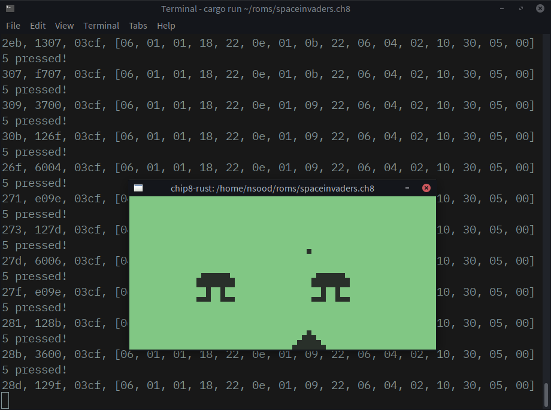

# chip8-rust

An implementation of the CHIP-8 programming language in Rust.

## Running a ROM

Given a CHIP-8 ROM, you can start the ROM in the emulator like so:

    cargo run romfile.ch8

[Here](https://github.com/dmatlack/chip8/tree/master/roms) is a large set of ROMs I found.

## Information on the emulator

The emulator runs at 480 Hz and updates the delay and sound timers (and the screen) once every 8 cycles, so at 60 Hz. The input is mapped similarly to most other CHIP-8 emulators I have come across:

Row 1|Row 2|Row 3|Row 4
-----|-----|-----|-----
1 - 1|2 - 2|3 - 3|C - 4
4 - Q|5 - W|6 - E|D - R
7 - A|8 - S|9 - D|F - 4
A - Z|0 - X|B - C|F - V

The screen runs at the default resolution of 64x32, scaled up 8x for better visibility.

## References

* **Cowgod's Chip-8 Technical Reference:** http://devernay.free.fr/hacks/chip8/C8TECH10.HTM
* **CHIP-8 Wikipedia Page:** https://en.wikipedia.org/wiki/CHIP-8
* **Reddit r/EmuDev commmunity:** https://reddit.com/r/EmuDev

## License

Code is provided under the MIT license; see LICENSE.md.